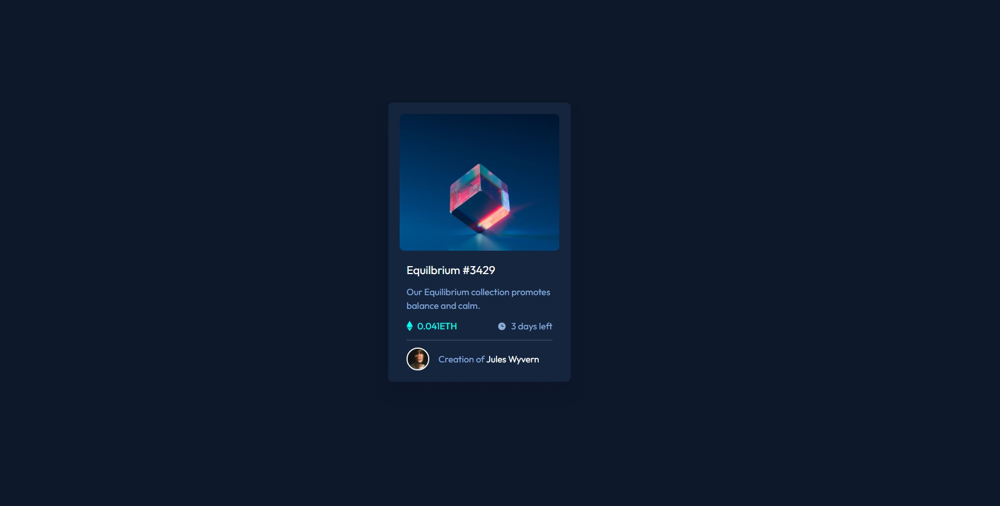

This is a solution to the [NFT preview card component challenge on Frontend Mentor](https://www.frontendmentor.io/challenges/nft-preview-card-component-SbdUL_w0U).

## Table of contents

- [Overview](#overview)
  - [The challenge](#the-challenge)
  - [Screenshot](#screenshot)
  - [Links](#links)
- [My process](#my-process)
  - [Built with](#built-with)
- [Author](#author)

## Overview

### The challenge

Users should be able to:

- View the optimal layout depending on their device's screen size
- See hover states for interactive elements

### Screenshot

### Links

- Solution URL: [Solution URL](https://github.com/EndaleKinfe/nft-preview-card-component)
- Live Site URL: [Live site URL](https://endalekinfe.github.io/nft-preview-card-component/)

## My process

### Built with

- Semantic HTML5 markup
- Flexbox
- Mobile-first workflow
- [React](https://react.dev/) - JS library
- [Tailwindcss](https://tailwindcss.com/) - css framework

## Author

- Website - [Endale Kinfe](https://endalekinfe.github.io/enduze/)
- Frontend Mentor - [@EndaleKinfe](https://www.frontendmentor.io/profile/EndaleKinfe)
- X - [@endaleisme](https://x.com/endaleisme)

